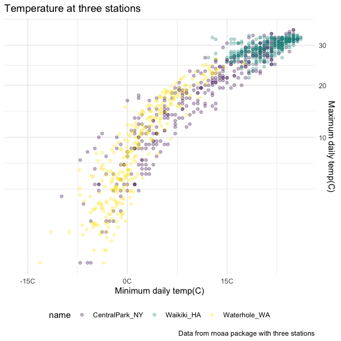

ggplot\_2
================

``` r
library(tidyverse)
```

    ## ── Attaching packages ─────────────────────────────────────── tidyverse 1.3.1 ──

    ## ✓ ggplot2 3.3.5     ✓ purrr   0.3.4
    ## ✓ tibble  3.1.4     ✓ dplyr   1.0.7
    ## ✓ tidyr   1.1.3     ✓ stringr 1.4.0
    ## ✓ readr   2.0.1     ✓ forcats 0.5.1

    ## ── Conflicts ────────────────────────────────────────── tidyverse_conflicts() ──
    ## x dplyr::filter() masks stats::filter()
    ## x dplyr::lag()    masks stats::lag()

``` r
library(viridis)
```

    ## Loading required package: viridisLite

``` r
library(ggridges)
knitr::opts_chunk$set(
  warning = FALSE,
  message = FALSE,
  fig.width = 6,
  fig.height = 6,
  out.width = "90%"
)
```

``` r
weather_df <- 
  rnoaa::meteo_pull_monitors(
    c("USW00094728", "USC00519397", "USS0023B17S"),
    var = c("PRCP", "TMIN", "TMAX"), 
    date_min = "2017-01-01",
    date_max = "2017-12-31") %>%
  mutate(
    name = recode(
      id, 
      USW00094728 = "CentralPark_NY", 
      USC00519397 = "Waikiki_HA",
      USS0023B17S = "Waterhole_WA"),
    tmin = tmin / 10,
    tmax = tmax / 10) %>%
  select(name, id, everything())
```

## Start with a familiar one

``` r
weather_df %>% 
  ggplot(aes(x = tmin, y = tmax, color = name)) +
  geom_point(alpha = .3) +
  labs(
    title = "Temperature at three stations",
    x = "Minimum daily temp(C)",
    y = "Maximum daily temp(C)",
    caption = "Data from rnoaa package with three stations"
  )
```


## Scales

``` r
weather_df %>% 
  ggplot(aes(x = tmin, y = tmax, color = name)) +
  geom_point(alpha = .3) +
  labs(
    title = "Temperature at three stations",
    x = "Minimum daily temp(C)",
    y = "Maximum daily temp(C)",
    caption = "Data from rnoaa package with three stations"
  ) +
  scale_x_continuous(
    breaks = c(-15, 0, 15),
    labels = c("-15C", "0C", "15C")
  ) +
  scale_y_continuous(
    trans = "sqrt",
    position = "right"
  )
```



``` r
weather_df %>% 
  ggplot(aes(x = tmin, y = tmax, color = name)) +
  geom_point(alpha = .3) +
  labs(
    title = "Temperature at three stations",
    x = "Minimum daily temp(C)",
    y = "Maximum daily temp(C)",
    caption = "Data from rnoaa package with three stations"
  ) +
  scale_color_hue(
    name = "Location"
  )
```


``` r
  scale_color_viridis_d()
```

    ## <ggproto object: Class ScaleDiscrete, Scale, gg>
    ##     aesthetics: colour
    ##     axis_order: function
    ##     break_info: function
    ##     break_positions: function
    ##     breaks: waiver
    ##     call: call
    ##     clone: function
    ##     dimension: function
    ##     drop: TRUE
    ##     expand: waiver
    ##     get_breaks: function
    ##     get_breaks_minor: function
    ##     get_labels: function
    ##     get_limits: function
    ##     guide: legend
    ##     is_discrete: function
    ##     is_empty: function
    ##     labels: waiver
    ##     limits: NULL
    ##     make_sec_title: function
    ##     make_title: function
    ##     map: function
    ##     map_df: function
    ##     n.breaks.cache: NULL
    ##     na.translate: TRUE
    ##     na.value: NA
    ##     name: waiver
    ##     palette: function
    ##     palette.cache: NULL
    ##     position: left
    ##     range: <ggproto object: Class RangeDiscrete, Range, gg>
    ##         range: NULL
    ##         reset: function
    ##         train: function
    ##         super:  <ggproto object: Class RangeDiscrete, Range, gg>
    ##     rescale: function
    ##     reset: function
    ##     scale_name: viridis_d
    ##     train: function
    ##     train_df: function
    ##     transform: function
    ##     transform_df: function
    ##     super:  <ggproto object: Class ScaleDiscrete, Scale, gg>

color scale `viridis`

## Themes

``` r
weather_df %>% 
  ggplot(aes(x = tmin, y = tmax, color = name)) +
  geom_point(alpha = .3) +
  labs(
    title = "Temperature at three stations",
    x = "Minimum daily temp(C)",
    y = "Maximum daily temp(C)",
    caption = "Data from rnoaa package with three stations"
  ) +
  scale_color_hue(
    name = "Location"
  ) +
  scale_color_viridis_d() +
  theme_bw() +
  theme(legend.position = "bottom")
```


### `theme` functions’ orders matter

``` r
weather_df %>% 
  ggplot(aes(x = tmin, y = tmax, color = name)) +
  geom_point(alpha = .3) +
  labs(
    title = "Temperature at three stations",
    x = "Minimum daily temp(C)",
    y = "Maximum daily temp(C)",
    caption = "Data from rnoaa package with three stations"
  ) +
  scale_color_hue(
    name = "Location"
  ) +
  scale_color_viridis_d() +
  theme_minimal() +
  theme(legend.position = "bottom")
```


## `data` in geoms

``` r
central_park <-
  weather_df %>% 
  filter(name == "CentralPark_NY")

waikiki <- 
  weather_df %>% 
  filter(name == "Waikiki_HA")

waikiki %>% 
  ggplot(aes(x = date, y = tmax, color = name)) +
  geom_point() +
  geom_line(data = central_park)
```


